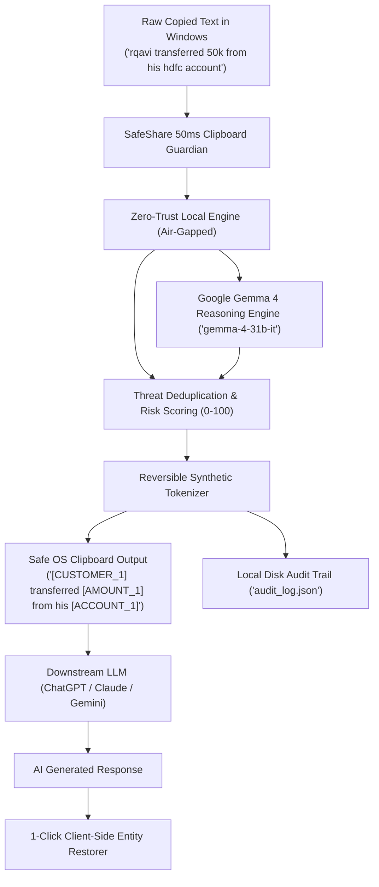

# 🛡️ SafeShare: Enterprise AI Privacy & Secret Firewall
> **Track:** Challenge 01 — Best Use of Gemma 4  
> **Event:** Hacktoberfest Hack Day Indore × PyData Indore | MLH Hack Days  
> **Venue:** Walkover, LIC Tower, Indore (4 Oct 2026)  
> **Model Identification:** **Google Gemma 4** (`gemma-4-31b-it` & `gemma-4-26b-a4b-it`)  
> **Architecture:** Zero-Trust Air-Gapped On-Device Firewall + Google Gemma 4 AI Reasoning  
> **License:** [MIT License](LICENSE) (Open Source)

---

## 📌 Problem Statement
Every day, engineers, support agents, and banking personnel copy and paste sensitive company data into commercial AI models (ChatGPT, Claude, Gemini). 

Without realizing it, they leak:
* **Indian Government Documents & Legal IDs:** Aadhaar cards (UIDAI), PAN cards, Passports, Driving Licenses, Voter IDs, Vehicle RC numbers, GSTIN, TAN, CIN, DIN, EPFO / UAN, and Ayushman Bharat Health IDs (ABHA).
* **Conversational Financial Disclosures:** Informal messages like *"rqavi transferred 50k from his hdfc account"* or *"transfer 10cr to supplier account"*.
* **Infrastructure Secrets:** AWS access keys, production database credentials, API tokens, passwords.
* **Corporate Confidential Information:** M&A deal valuations, executive compensation, patient PHI.

Under India's **Digital Personal Data Protection Act (DPDP Act 2023)**, **RBI Guidelines**, and **PCI-DSS**, these exposures trigger massive regulatory penalties. Traditional filters fail because they miss conversational context, typos, and non-standard groupings.

---

## 💡 The Solution: SafeShare
**SafeShare** is an enterprise AI privacy firewall and semantic anonymizer engineered around **Google Gemma 4**:

1. **Zero-Trust Air-Gapped Local Firewall (0ms Cloud Latency):**
   - Runs 100% locally on Windows (`127.0.0.1:8000`).
   - **Zero Cloud Egress:** Not a single byte of sensitive text or copied data ever leaves your device.
   - Monitors the Windows system clipboard at **50ms ultra-low latency** via native Win32 API.
2. **Google Gemma 4 Reasoning Architecture (`gemma-4-31b-it`):**
   - Engineered with deep regulatory reasoning prompts and structured JSON schema constraints to detect typos (*"rqavi"*, *"adhar 452009 25009 42009"*, *"passwrd"*, *"50k"*) with **strict verbatim grounding**.
3. **Reversible Synthetic Anonymization (The Key Innovation):**
   - Replaces sensitive data with functional synthetic tokens:
     - `rqavi transferred 50k from his hdfc account` $\to$ `[CUSTOMER_1] transferred [AMOUNT_1] from his [ACCOUNT_1]`
     - `Pan: ABCDE1234F, Passport: Z1234567` $\to$ `Pan: [PAN_CARD_1], Passport: [PASSPORT_1]`
   - **Why this matters:** The prompt **remains 100% functional** and contextually intact for downstream LLMs!
4. **Client-Side Reversible Decoder Vault:**
   - The token mapping vault is kept exclusively in local memory.
   - Re-injects original data with 1-click on your device when the AI responds.
5. **Local Persistent Audit Store (`audit_log.json`):**
   - Every intercepted event is stored locally on physical disk with timestamp, machine host (`APARAJEET`), user (`devhe`), and category breakdown.

---

## 🤖 Google Gemma 4 Model Integration

SafeShare is built specifically for **Google Gemma 4** open-weights model architecture:

* **Primary Reasoning Brain (`gemma-4-31b-it`):** 31B dense instruction-tuned model. Delivers human-grade contextual reasoning to classify complex conversational transfers, banking disputes, and compliance risks under DPDP Act 2023.
* **Low-Latency Alternate (`gemma-4-26b-a4b-it`):** 26B total / 4B active parameter Mixture-of-Experts (MoE) model. Ultra-fast audit latency.

### Code Integration (`safeshare_engine.py`)
```python
from safeshare_engine import GEMMA_4_MODELS, SYSTEM_INSTRUCTION

# Google Gemma 4 Model Registry
GEMMA_4_MODELS = {
    "gemma-4-31b-it": {
        "name": "Gemma 4 31B (Dense)",
        "description": "31B parameter instruction-tuned dense model. Highest contextual classification accuracy.",
        "id": "gemma-4-31b-it",
    },
    "gemma-4-26b-a4b-it": {
        "name": "Gemma 4 26B/4B (MoE)",
        "description": "26B total / 4B active parameter Mixture-of-Experts. Ultra-fast audit latency.",
        "id": "gemma-4-26b-a4b-it",
    },
}
```

---

## 🏗️ Architecture & Data Flow



---

## 🇮🇳 Complete Indian Legal Documents & Data Formats Covered

| Category | Formats & Documents Protected | Synthetic Output |
| :--- | :--- | :--- |
| **Government IDs** | **Aadhaar** (any grouping), **PAN Card**, **Indian Passport**, **Voter ID / EPIC**, **Driving License (DL)**, **Vehicle RC (Vahan)**, **Ration Card** | `[AADHAAR_1]`, `[PAN_CARD_1]`, `[PASSPORT_1]`, `[DRIVING_LICENSE_1]`, `[VEHICLE_RC_1]` |
| **Corporate & Tax** | **GSTIN (GST Number)**, **TAN**, **CIN (Corporate ID)**, **DIN (Director ID)**, **EPFO / UAN / PF Account** | `[GSTIN_1]`, `[TAN_1]`, `[CIN_1]`, `[DIN_1]`, `[UAN_1]` |
| **Healthcare** | **Ayushman Bharat Health ID (ABHA)**, **PMJAY Card Numbers** | `[HEALTH_ID_1]` |
| **Legal & Police** | **Police FIR Numbers**, **Court Case Numbers**, **Property Deeds / Khasra / Khatauni** | `[LEGAL_DOC_1]` |
| **Conversational** | **Transactors & Actions** (*"rqavi transferred"*, *"priya paid"*, *"rahul sent"*) | `[CUSTOMER_1]` |
| **Amounts & Currency**| **Shorthand & Symbols** (`50k`, `100k`, `2.5L`, `10cr`, `50 lacs`, `150000 rs`, `₹45,000`, `INR 1,50,000`, `$50,000`) | `[AMOUNT_1]` |
| **Banking** | **Bank Accounts**, Bank references (*"hdfc account"*, *"sbi bank"*), IFSC codes, UPI handles (`xyz@okhdfcbank`), Credit/Debit cards | `[ACCOUNT_1]`, `[CARD_1]`, `[UPI_ID_1]` |
| **Secrets** | Passwords, PINs, OTPs, AWS Access Keys, API Keys, Private Keys, IPv4 addresses | `[PASSWORD_1]`, `[API_KEY_1]` |

---

## 🚀 Quickstart: Run in 10 Seconds

### Prerequisites
* Python 3.10+ (Tested on Python 3.14 on Windows)
* **Zero API keys required for offline zero-trust operation!**

### 1. Clone & Install
```bash
git clone https://github.com/Shiv-10-16/SafeShare.git
cd SafeShare
pip install -r requirements.txt
```

### 2. Launch Desktop Application
```bash
python desktop_app.py
```
*(Or `python run.py`)*

This single command:
1. Starts the local SafeShare Privacy Core.
2. Starts the background 50ms Windows Clipboard Guardian daemon.
3. Opens the **native standalone desktop window** with live telemetry and local audit log table!

---

## 🖥️ SafeShare Desktop Application Features

* **Continuous 50ms Clipboard Guardian:** Monitors Windows clipboard events and instantly sanitizes secrets before they can be pasted into ChatGPT, Claude, or any AI tool.
* **Side-by-Side Audit Log:** See exactly **What Was Copied (Original)** vs **What SafeShare Made (Sanitized)** with click-to-unmask toggle.
* **Interactive Pause / Resume Button:** Suspend protection temporarily whenever needed with live status indicators.
* **1-Click Clipboard Restorer:** Restore sanitized synthetic tokens back to original values in your clipboard with one click.
* **Zero Cloud Dependence:** Complete privacy guarantee under India's DPDP Act 2023.

---

## 🛠️ Technology Stack
* **Language & Runtime:** Python 3, Starlette, Uvicorn, Win32 `ctypes` API
* **AI Architecture:** Google Gemma 4 (`gemma-4-31b-it` / `gemma-4-26b-a4b-it`)
* **Storage:** Local Persistent JSON Audit Store (`audit_log.json`)
* **UI:** Modern Cyber-Security UI (Lucide Icons, JetBrains Mono, Inter)
* **Compliance Standards:** DPDP Act 2023, RBI Cyber Security Framework, PCI-DSS 4.0, GDPR

---

## 📝 Open-Source License
Released under the [MIT License](LICENSE).
