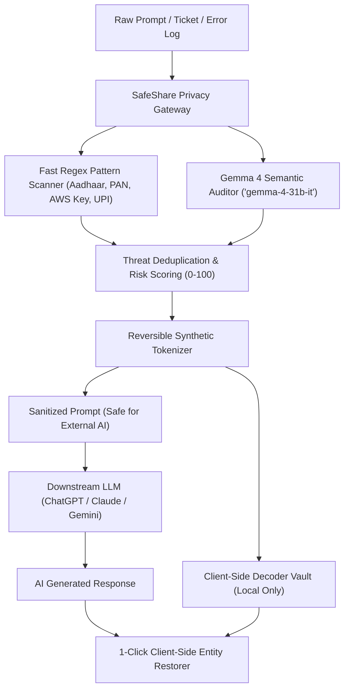

# 🛡️ SafeShare: Enterprise AI Privacy & Secret Firewall
> **Track:** Challenge 01 — Best Use of Gemma 4  
> **Event:** Hacktoberfest Hack Day Indore × PyData Indore | MLH Hack Days  
> **Venue:** Walkover, LIC Tower, Indore (4 Oct 2026)  
> **Sponsor Alignment:** IDFC FIRST Bank (Banking & Compliance) & Walkover  
> **Model Identification:** **Google Gemma 4** (`gemma-4-31b-it` & `gemma-4-26b-a4b-it`) via Gemini API  
> **License:** [MIT License](LICENSE) (Open Source)

---

## 📌 Problem Statement
Every day, engineers, customer support agents, and banking personnel paste sensitive company text into commercial AI models (ChatGPT, Claude, Gemini) to fix bugs or summarize tickets. 

Without realizing it, they leak:
* **Banking & Financial PII:** Aadhaar numbers, PAN cards, credit/debit card numbers, UPI handles, customer CIFs.
* **Infrastructure Secrets:** AWS access keys, production database credentials with passwords, superadmin JWT session tokens.
* **Corporate Confidential Information:** M&A deal valuations, executive compensation records, unpublished patent filings.

Under India's **Digital Personal Data Protection Act (DPDP Act 2023)**, **RBI Digital Payment Security Guidelines**, and **PCI-DSS**, these exposures trigger massive regulatory fines and severe corporate breaches. Traditional regex filters fail because they miss semantic context (e.g., *"Rahul's savings account near the Palasia branch"*).

---

## 💡 The Solution: SafeShare
**SafeShare** is an enterprise AI privacy firewall and semantic anonymizer powered by Google's **Gemma 4** open-weight model through the Gemini API:

1. **Hybrid Threat Detection Engine:**
   * **Fast Heuristic Scanner:** Catches structured patterns (Aadhaar, PAN, Cards, UPI handles, AWS keys, IPv4).
   * **Gemma 4 Semantic Auditor (`gemma-4-31b-it`):** Understands nuanced context—distinguishes dummy test data from live credentials, flags unpublished intellectual property, protected health information (PHI), and corporate deal terms with **verbatim quotation grounding**.
2. **Reversible Synthetic Anonymization (The Key Innovation):**
   * Instead of just blanking out text with `[REDACTED]`, SafeShare replaces sensitive entities with consistent synthetic tokens (`[CUSTOMER_1]`, `[BANK_ACCOUNT_1]`, `[DEAL_VALUATION_1]`).
   * **Why this matters:** The downstream AI prompt **remains 100% functional** and contextually intact!
3. **Client-Side Reversible Decoder Vault:**
   * The substitution table is kept exclusively in client-side memory.
   * When the external AI returns its response, SafeShare re-injects the original names and accounts **locally in your browser with 1 click**.
4. **Data Exposure Risk Meter & Compliance Audit:**
   * Computes a real-time **Risk Score (0–100)**.
   * Generates a one-click compliance audit report aligned with DPDP Act, RBI Guidelines, and PCI-DSS.

---

## 🤖 Google Gemma 4 Model Integration

SafeShare explicitly integrates **Google Gemma 4** instruction-tuned models via the **Google Gemini API**:

* **Primary Model (`gemma-4-31b-it`):** 31B dense model. Provides state-of-the-art semantic reasoning for complex regulatory compliance, distinguishing high-risk data from harmless context.
* **Low-Latency Alternate (`gemma-4-26b-a4b-it`):** 26B parameter / 4B active parameter Mixture-of-Experts (MoE) model. Ultra-fast audit latency.

### Code Integration (`safeshare_engine.py`)
```python
import urllib.request, json
from safeshare_engine import GEMMA_4_MODELS, SYSTEM_INSTRUCTION

# Call Gemma 4 via Gemini API
endpoint = f"https://generativelanguage.googleapis.com/v1beta/models/{model_id}:generateContent?key={GEMINI_API_KEY}"

payload = {
    "contents": [{"role": "user", "parts": [{"text": prompt_content}]}],
    "generationConfig": {
        "temperature": 0.1,
        "responseMimeType": "application/json"
    }
}
```

---

## 🏗️ Architecture & Data Flow



---

## 🚀 Quickstart: Run in 30 Seconds

### Prerequisites
* Python 3.10+ (Tested on Python 3.14)
* A Gemini API Key from [Google AI Studio](https://ai.google.dev) (Free tier)

### 1. Clone & Install
```bash
git clone https://github.com/your-username/safeshare.git
cd safeshare
pip install -r requirements.txt
```

### 2. Configure API Key
```bash
# Windows PowerShell
$env:GEMINI_API_KEY="your_api_key_here"

# Linux / macOS
export GEMINI_API_KEY="your_api_key_here"
```
*(Or launch the app and paste your key in the header's **"Gemini API Key"** settings button).*

### 3. Launch the SafeShare Desktop Application
```bash
python desktop_app.py
# or
python run.py
```
This single command:
1. Starts the local SafeShare Privacy Core.
2. Starts the background 50ms Windows Clipboard Guardian.
3. Automatically launches the **native standalone desktop application window** matching our modern Coinview pastel & obsidian theme reference!

---

## 🖥️ SafeShare Desktop Application Features

SafeShare eliminates human error completely. The desktop application runs silently in the background, continuously safeguarding your clipboard and storing an immutable local audit log:

```
+---------------------------------------------------------------------------------------+
|  1. USER COPIES SENSITIVE DATA ANYWHERE IN WINDOWS                                    |
|     (e.g., "Rajesh, adhar 4532 8901 2345, passwrd LicTower@2026")                     |
+-------------------------------------------+-------------------------------------------+
                                            |
                                            v
+---------------------------------------------------------------------------------------+
|  2. AUTOMATED ZERO-TRUST INTERCEPTION                                                 |
|     - Detects OS clipboard change within 50ms via Win32 API                           |
|     - Replaces secrets with synthetic tokens: "[CUSTOMER_1], adhar [AADHAAR_1]..."   |
|     - Automatically saves permanent audit trail to local `audit_log.json` on this PC  |
|     - Reversible vault stored in local memory only                                    |
+-------------------------------------------+-------------------------------------------+
                                            |
                                            v
+---------------------------------------------------------------------------------------+
|  3. EXTERNAL AI ONLY RECEIVES SANITIZED SYNTHETIC TOKENS                              |
|     (Zero sensitive data ever touches OpenAI, Anthropic, or Claude servers!)          |
+---------------------------------------------------------------------------------------+
```

### ⏸️ Interactive Pause / Resume Protection
* Click the **"Pause Protection"** button in the dashboard or sidebar power icon at any time to temporarily suspend clipboard interception.
* While paused, the UI displays an amber indicator (`Shield Paused`), and your clipboard passes raw text untouched.
* Click **"Resume Protection"** to immediately re-enable zero-trust protection.

### 💾 Local System Audit Logging (`audit_log.json`)
* Every intercepted copy operation is permanently logged to `audit_log.json` on the specific machine (`COMPUTERNAME` and `USERNAME` stamped).
* Logs store the original text, sanitized tokens, categories, and exact timestamps.
* The UI includes an interactive table with **click-to-reveal unblur** and an **"Export JSON"** button for compliance audits.
2. Enable **"Developer mode"** (toggle in the top-right corner).
3. Click **"Load unpacked"** and select the `f:\MLH\extension` folder.
4. Open **[chatgpt.com](https://chatgpt.com)**, **[claude.ai](https://claude.ai)**, or **[gemini.google.com](https://gemini.google.com)**.
5. Paste any sensitive test text into the prompt box. Watch SafeShare automatically sanitize the prompt before submission!
6. Click the floating **SafeShare badge** on the bottom-left to view intercepted tokens or decode the AI's response on screen.

---

## 🎯 Key Features Walkthrough

| Feature | Description |
| :--- | :--- |
| **Desktop Clipboard Guardian** | Background OS daemon that sanitizes Windows clipboard in real time (`clipboard_guard.py`). |
| **Browser Extension** | Chrome/Edge extension that protects ChatGPT, Claude, and Gemini on paste (`extension/`). |
| **Typo & Slang Tolerant** | Uses Gemma 4 to detect sensitive entities even with misspellings (*adhar*, *passwrd*, *acct*, *pw*). |
| **Live Threat Benchmarks** | 4 pre-loaded realistic scenarios: *🏦 IDFC Banking Dispute*, *💻 DevOps Production Crash*, *🩺 HR & Medical Record*, *🏢 M&A Deal Terms Leak*. |
| **Reversible Synthetic Tokenization** | Keeps prompts fully coherent for external AI models while substituting all PII/secrets with `[ENTITY_TYPE_N]`. |
| **Local Vault & Restorer** | Restores synthetic tokens back to original values locally in the browser or via CLI without leaking data. |
| **One-Click Audit Report** | Export a comprehensive compliance audit report in Markdown format. |
| **Wi-Fi Safe Mode** | Deterministic pre-computed audit benchmarks guarantee the live demo never fails on congested event Wi-Fi. |

---

## 🛠️ Technology Stack
* **Language & Framework:** Python 3, Starlette, Uvicorn, Win32 ctypes API
* **AI Model:** Google Gemma 4 (`gemma-4-31b-it` / `gemma-4-26b-a4b-it`) via Google Gemini API
* **Browser Extension:** Manifest V3 (Chrome, Edge, Brave)
* **Frontend:** Modern Cyber-Security UI (Tailwind CSS, Lucide Icons, JetBrains Mono font)
* **Standards & Compliance:** DPDP Act 2023, RBI Cyber Security Framework, PCI-DSS 4.0, GDPR Art. 9

---

## 📝 Open-Source & AI Usage Disclosure
In accordance with MLH and PyData Indore Hack Day competition guidelines:
* **Open Source License:** Released under the [MIT License](LICENSE).
* **AI Usage Disclosure:** Google Gemma 4 was used as the core AI reasoning and entity extraction engine. Code generation tools were used for UI scaffolding during Hack Day. All architecture, schema constraints, pattern regex matching, and vault mechanisms were designed by the team.

---

## 👥 PyData Indore & MLH Submission
* **Event:** Hacktoberfest Hack Day Indore × PyData Indore
* **Partner Challenge:** Best Use of Gemma 4 (Google)
